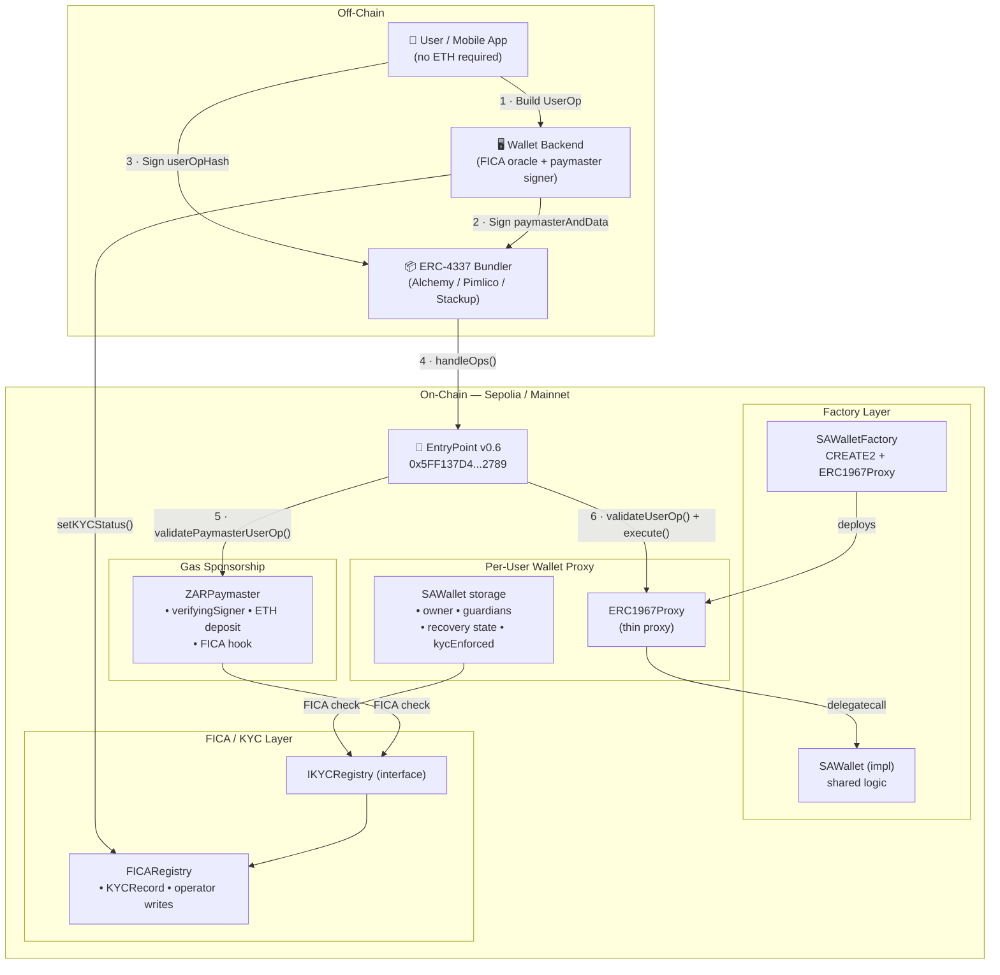

# ZAKA: SA Smart Wallet Factory

> **Digital Rands for any phone. ZAKA runs on USSD and SMS for feature phones and a web wallet for smartphones, and settles on ERC-4337 smart wallets on Sepolia.**

People dial `*384*123#`, set a PIN, enter their SA ID number and have a wallet in about 30 seconds. They send ZAKA to other phone numbers, get SMS confirmations, and never see a blockchain, a wallet address or a gas fee. Underneath, each person has an [ERC-4337](https://github.com/eth-infinitism/account-abstraction) smart wallet, a paymaster sponsors all gas, and tiered KYC limits (aligned with [FICA](https://www.fic.gov.za)) cap what each account can move.

---

## Table of Contents

1. [What's in this repo](#whats-in-this-repo)
2. [Running and deploying](#running-and-deploying)
3. [Security and reliability design](#security-and-reliability-design)
   - [SIM-swap attacks](#1-sim-swap-attacks)
   - [USSD session timeouts](#2-ussd-session-timeouts)
   - [KYC without friction](#3-kyc-without-friction)
4. [Smart contracts](#smart-contracts)
   - [Overview](#overview)
   - [Architecture](#architecture)
   - [Contract Breakdowns](#contract-breakdowns)
   - [Script Breakdowns](#script-breakdowns)
   - [Configuration](#configuration)
   - [Getting Started](#getting-started)
   - [ERC-4337 Transaction Lifecycle](#erc-4337-transaction-lifecycle)
   - [Social Recovery Walkthrough](#social-recovery-walkthrough)
   - [FICA / KYC Integration Guide](#fica--kyc-integration-guide)
   - [Security Considerations](#security-considerations)
   - [Dependencies](#dependencies)

---

## What's in this repo

| Part | Folder | What it is | Docs |
|---|---|---|---|
| Smart contracts | `contracts/`, `scripts/`, `test/` | `SAWallet` (ERC-4337 account), `SAWalletFactory` (CREATE2), `ZARPaymaster` (gas sponsorship), `FICARegistry`, `MockZAR` (the ZAKA token). Deployed and verified on Sepolia | [below](#smart-contracts) |
| Backend | `backend/` | Express + SQLite. USSD menu (Africa's Talking webhook), SMS, KYC tiers and limits, background transfers, REST API for the web apps | [backend/README.md](backend/README.md) |
| Web wallet | `frontend/` | React app: landing page, sign-up/login, balance, send, receive (QR), identity check (mock Smile ID) | [frontend/README.md](frontend/README.md) |
| USSD simulator | `simulator/` | Feature phones in the browser that call the backend exactly like Africa's Talking, with SMS inboxes and an account panel | [simulator/README.md](simulator/README.md) |

```
smartWalletFactory/
├── contracts/            Solidity (OpenZeppelin v4 + account-abstraction v0.6)
├── scripts/              deploy.js, verify.js, stakePaymaster.js, signUserOp.js
├── test/                 SAWallet.test.js
├── backend/              ZAKA server (USSD, SMS, KYC, transfers, API)
├── frontend/             ZAKA web wallet
├── simulator/            USSD simulator
├── setup.md              full local setup walkthrough
└── hardhat.config.js
```

**What people get:**

- **USSD menu:** 1. Check Balance, 2. Send ZAKA, 3. Claim R100 Demo ZAKA, 4. My Account. Shortcut dialling (`*384*123*2*0831234567*50#`) and resuming dropped sessions.
- **SMS:** on receiving money, on every completed or failed send (with a ULID reference), on validation, and when a limit is reached.
- **KYC tiers:** Level 0 (ID number on USSD) allows R500 a day and R10,000 a month. Level 1 (validated at a merchant or on the website) allows R25,000 a day and R100,000 a month.
- **R0 transfer fees** between ZAKA users. Gas is sponsored by the paymaster.

---

## Running and deploying

- **Locally:** follow [setup.md](setup.md). It covers deploying the contracts, configuring and starting the backend, and running the simulator.
- **Hosted (Railway):** three services from this repo.

| Service | Root Directory | Start | Needs |
|---|---|---|---|
| backend | `backend` | `npm start` | A volume at `/app/data` (the SQLite database), all variables from `backend/.env.example` |
| frontend | `frontend` | `npm start` | `VITE_API_URL=https://<backend-domain>` |
| simulator | `simulator` | `npm start` | `VITE_API_URL=https://<backend-domain>` |

Then set the Africa's Talking USSD callback to `https://<backend-domain>/ussd` and the SMS delivery report URL to `https://<backend-domain>/api/sms/delivery`. Node 20+ is required.

---

## Security and reliability design

These are the three questions that matter most for a USSD money product: what happens when someone's SIM is stolen, what happens when the network cuts a session, and how to do KYC without losing people at sign-up. Each item is marked **Built** (in this repo today) or **Planned**.

### 1. SIM-swap attacks

**Who can detect a swap: the mobile networks, not Smile ID.** In February 2024, MTN, Cell C and Telkom launched a SIM Swap API through the GSMA Open Gateway initiative. You give it a phone number and it tells you whether that number's SIM changed recently. Vodacom wasn't part of that announcement, so covering Vodacom numbers needs an aggregator or a direct agreement with Vodacom.

Smile ID's documentation doesn't describe any SIM-swap detection. Its phone-number check matches a number against identity records, which is a different thing. **Where Smile ID helps is getting the real person back in after a swap:** its selfie check confirms that the person is the one who enrolled.

The defence has four layers:

| Layer | What it does | Status |
|---|---|---|
| **1. Detect** | Before any send, PIN change or limit upgrade, call the network's SIM Swap API. If the SIM changed in the last few days, freeze sending. Receiving money and checking the balance still work. | Planned |
| **2. Limit the damage** | The KYC tiers cap what a compromised account can move. Even in the worst case, a Level 0 account can lose at most R500 a day (R10,000 a month). | **Built** |
| **3. Require something the SIM doesn't carry** | A swapped SIM gets an attacker onto the menu, but every send still needs the PIN. The PIN is never sent by SMS, and a PIN typed into a dial code is refused. | **Built** |
| **4. Recover** | Unfreeze the account only after a Smile ID selfie check at a merchant or on the website. Also send an alert through a second channel, such as a trusted contact's number. | Planned. The web selfie flow exists as a mock |

**The weak spot is PIN reset.** A reset must never be allowed on the phone number alone, because the phone number is exactly what a SIM swap steals. ZAKA has no PIN reset today. When one is added, it has to go through the layer 4 recovery check. It also needs a way to re-key the wallet: each wallet's key is encrypted with a key derived from the PIN, so a forgotten PIN can't simply be replaced. That means giving wallets a recovery path. The contract already supports guardians, but the backend creates wallets without any.

### 2. USSD session timeouts

Networks cut a USSD session after a short limit that each operator sets. The limit covers both how long the person takes on each screen and how long the backend takes to reply.

| Strategy | What it does | Status |
|---|---|---|
| **Never make the user wait for the blockchain** | After the PIN, the backend checks limits and balance, saves the transfer as *pending* with a reference, and replies straight away: "Sending R50.00 to 0831234567. You will receive an SMS…". The blockchain part runs in the background (`backend/services/transferService.js`), and the SMS confirmation closes the loop. This is the most important of the four. | **Built** |
| **Resume dropped sessions** | A send's progress is saved against the phone number (never the PIN) for `USSD_RESUME_MINUTES` (default 5). Redialling asks "Continue sending R50.00 to 0831234567? 1. Yes 2. No". | **Built** |
| **Shortcut dialling** | Everything in one code, e.g. `*384*123*2*0831234567*50#`, leaves only the PIN screen. | **Built** |
| **Protect against double sends** | Give each transfer a unique key built from the session and its inputs, so a retry after a timeout never sends the money twice. Today, pending transfers already count against the balance and limits, so a repeat can't overspend. But a retried request could still record a second transfer. | Planned |

The target for every flow is:
- four screens or fewer (Send ZAKA is menu → recipient → amount → PIN, or just the PIN screen with a shortcut)
- a reply in under two seconds
- slow work finished by SMS
- a way to resume after a drop

### 3. KYC without friction

| Level | Where | Check | Status |
|---|---|---|---|
| **0** | USSD, at registration | The ID number's format, date of birth and checksum are validated instantly as a first filter. Next, check the number against the government database through Smile ID in the background, so registration doesn't slow down. | Checksum **built**. Smile ID lookup planned |
| **1** | At a merchant or on the website | A Smile ID selfie plus ID check. This is the same flow used to recover an account after a SIM swap, so one integration covers both. | Merchant/website validation endpoint **built**. The web selfie flow is a mock of Smile ID Biometric KYC |

**People start using ZAKA in about 30 seconds with nothing but an ID number.** They only do the full check when they need higher limits, so compliance scales with risk instead of blocking the first use.

---

## Smart contracts

### Overview

| Goal | How it is achieved |
|---|---|
| No ETH required from users | `ZARPaymaster` sponsors gas from a pre-funded EntryPoint deposit |
| Lost key recovery | Guardian quorum + 48-hour timelock in `SAWallet` |
| FICA compliance | `FICARegistry` + `IKYCRegistry` interface hooks in both wallet and paymaster |
| Deterministic addresses | `SAWalletFactory` uses CREATE2 — addresses are known before deployment |
| Upgradeable wallets | UUPS proxy pattern (`ERC1967Proxy` + `_authorizeUpgrade`) |
| Replay-proof gas approval | Paymaster hash commits to chainId, paymaster address, validity window |

---

### Architecture



---

### Contract Breakdowns

#### `contracts/interfaces/IKYCRegistry.sol`

**Purpose:** Shared interface that decouples the compliance layer from wallet and paymaster logic. Any production FICA oracle — Chainlink external adapter, Merkle-proof verifier, or a centralised registry — can be plugged in without touching `SAWallet` or `ZARPaymaster`.

#### Interface functions

| Function | Visibility | Description |
|---|---|---|
| `isKYCApproved(address user)` | `view` | Returns `true` if the address has a valid FICA clearance |
| `isKYCApprovedForAmount(address user, uint256 amountInZAR)` | `view` | Returns `true` if cleared AND the amount is ≤ the per-user ZAR transaction limit |
| `approvalTimestamp(address user)` | `view` | Unix timestamp of the most recent FICA approval |

#### Events

| Event | When emitted |
|---|---|
| `KYCStatusUpdated(address user, bool approved, uint256 timestamp)` | Any change to an address's FICA status |
| `TxLimitUpdated(address user, uint256 limitInZAR)` | Per-address transaction limit is changed |

---

#### `contracts/FICARegistry.sol`

**Purpose:** Lightweight on-chain store for FICA decisions. An off-chain compliance service (ID document + selfie + liveness check) writes results through a privileged **operator** key. Both `SAWallet` and `ZARPaymaster` read from this contract via `IKYCRegistry`.

#### State

| Variable | Type | Description |
|---|---|---|
| `owner` | `address` | Can add/remove operators and transfer ownership |
| `isOperator` | `mapping(address → bool)` | Addresses authorised to write KYC decisions |
| `_records` | `mapping(address → KYCRecord)` | Per-user FICA records (private) |

#### `KYCRecord` struct

| Field | Type | Description |
|---|---|---|
| `approved` | `bool` | Whether the user passed FICA |
| `approvedAt` | `uint256` | Unix timestamp of approval (0 if not approved) |
| `txLimitZAR` | `uint256` | Max single-transaction value in ZAR cents; `0` = unlimited |

#### Key functions

| Function | Access | Description |
|---|---|---|
| `setKYCStatus(address, bool, uint256)` | `onlyOperator` | Write a FICA decision and transaction limit for one user |
| `batchSetKYCStatus(address[], bool[], uint256[])` | `onlyOperator` | Gas-optimised bulk approval for onboarding flows |
| `setOperator(address, bool)` | `onlyOwner` | Grant or revoke operator rights |
| `transferOwnership(address)` | `onlyOwner` | Hand off ownership to a multi-sig in production |
| `getRecord(address)` | `view` | Return the full `KYCRecord` struct for an address |

#### Testnet note
On Sepolia both `SAWallet.kycEnforced` and `ZARPaymaster.kycEnforced` default to `false`, so the registry is deployed but never consulted. Flip both flags to `true` in production once the off-chain FICA oracle is live.

---

#### `contracts/SAWallet.sol`

**Purpose:** The core ERC-4337 smart account. Each user gets one proxy instance backed by this shared implementation. Designed to replace a traditional EOA wallet for South African users.

#### Inheritance chain

```
SAWallet
  ├── BaseAccount          (eth-infinitism — ERC-4337 validateUserOp logic)
  ├── TokenCallbackHandler (eth-infinitism — ERC-721/1155 receive hooks)
  ├── UUPSUpgradeable      (OpenZeppelin — UUPS upgrade mechanism)
  └── Initializable        (OpenZeppelin — constructor guard for proxies)
```

#### State variables

| Variable | Type | Description |
|---|---|---|
| `_entryPoint` | `IEntryPoint` (immutable) | Canonical EntryPoint this wallet trusts |
| `owner` | `address` | Primary signing key |
| `isGuardian` | `mapping(address → bool)` | Active guardians |
| `guardianCount` | `uint256` | Number of active guardians |
| `recoveryThreshold` | `uint256` | Minimum approvals for recovery |
| `RECOVERY_TIMELOCK` | `uint256` (constant) | 48 hours — mandatory wait after quorum |
| `recoveryNonce` | `uint256` | Increments with each new proposal; invalidates old votes |
| `currentRecovery` | `RecoveryProposal` | Active recovery proposal |
| `_recoveryApprovals` | `mapping(nonce → address → bool)` | Per-proposal guardian votes |
| `kycRegistry` | `address` | Deployed `FICARegistry` address (or zero to disable) |
| `kycEnforced` | `bool` | When `true`, the `ficaCompliant` modifier is active |

#### `RecoveryProposal` struct

| Field | Type | Description |
|---|---|---|
| `proposedOwner` | `address` | Candidate new owner |
| `approvalCount` | `uint256` | Running tally of guardian votes |
| `readyAt` | `uint256` | Timestamp when quorum was reached (`0` = not yet) |
| `executed` | `bool` | Prevents double-execution |

#### Modifiers

| Modifier | Guard |
|---|---|
| `onlyOwner` | `msg.sender == owner \|\| msg.sender == address(this)` |
| `onlyGuardian` | `isGuardian[msg.sender]` |
| `ficaCompliant` | If `kycEnforced && kycRegistry != address(0)` → consults `IKYCRegistry.isKYCApproved(owner)` |

#### Key functions

| Function | Access | Description |
|---|---|---|
| `initialize(address, address[], uint256)` | `initializer` | Called once by the factory proxy; sets owner, guardians, threshold |
| `execute(address, uint256, bytes)` | EntryPoint or owner | Single arbitrary call; gated by `ficaCompliant` modifier |
| `executeBatch(address[], uint256[], bytes[])` | EntryPoint or owner | Batch of calls in one UserOperation (e.g. approve + transfer) |
| `_validateSignature(UserOperation, bytes32)` | internal `view` | Recovers signer from EIP-191 hash; returns `0` or `SIG_VALIDATION_FAILED` |
| `addGuardian(address)` | `onlyOwner` | Add a guardian to the recovery set |
| `removeGuardian(address)` | `onlyOwner` | Remove a guardian; reverts if it would break the threshold |
| `setRecoveryThreshold(uint256)` | `onlyOwner` | Update quorum requirement |
| `initiateRecovery(address)` | `onlyGuardian` | Open a new recovery proposal; increments `recoveryNonce` |
| `approveRecovery()` | `onlyGuardian` | Vote for the current proposal; starts timelock when quorum reached |
| `executeRecovery()` | anyone | Install new owner after quorum + 48-hour timelock |
| `cancelRecovery()` | `onlyOwner` | Veto a pending proposal during the timelock window |
| `setKYCRegistry(address, bool)` | `onlyOwner` | Point the wallet at a FICARegistry and toggle enforcement |
| `_authorizeUpgrade(address)` | `onlyOwner` (internal) | UUPS guard; only owner can upgrade the implementation |

#### Events

```
SAWalletInitialized(address entryPoint, address owner)
Executed(address dest, uint256 value, bytes data)
GuardianAdded(address guardian)
GuardianRemoved(address guardian)
RecoveryThresholdUpdated(uint256 threshold)
RecoveryInitiated(uint256 nonce, address proposedOwner, address by)
RecoveryApproved(uint256 nonce, address by, uint256 totalApprovals)
RecoveryExecuted(address oldOwner, address newOwner)
RecoveryCancelled(uint256 nonce)
KYCRegistrySet(address registry, bool enforced)
```

---

#### `contracts/SAWalletFactory.sol`

**Purpose:** Deploys SAWallet proxy instances using CREATE2, producing deterministic addresses. Front-ends can display a user's wallet address and accept incoming ZAR stablecoin transfers **before** the wallet is deployed — deployment gas is only spent on the first outgoing transaction.

#### State

| Variable | Type | Description |
|---|---|---|
| `accountImplementation` | `SAWallet` (immutable) | Shared implementation; all proxies delegatecall here |

#### Key functions

| Function | Access | Description |
|---|---|---|
| `createAccount(address owner, address[] guardians, uint256 threshold, uint256 salt)` | `external` | Deploy (idempotent) and return the SAWallet proxy. Safe to include in `initCode` — if the wallet already exists it returns the existing instance instead of reverting. |
| `getAddress(address owner, address[] guardians, uint256 threshold, uint256 salt)` | `view` | Pre-compute the CREATE2 wallet address without deploying anything. Mirror this in JS with `ethers.getCreate2Address`. |

#### CREATE2 address formula

```
address = CREATE2(
  salt      = bytes32(salt),
  initCode  = ERC1967Proxy.creationCode
              + abi.encode(accountImplementation, SAWallet.initialize.selector + args)
)
```

The `salt` parameter allows one owner to maintain multiple independent wallets (e.g. personal + business).

#### Events

```
AccountCreated(address indexed account, address indexed owner, uint256 salt)
```

---

#### `contracts/ZARPaymaster.sol`

**Purpose:** Verifying paymaster that sponsors Ethereum gas on behalf of SA wallet users. Users never need to hold ETH. The wallet operator runs a backend that signs UserOperations that pass rate-limiting, fraud detection, and FICA status checks. An optional on-chain FICA check provides defence-in-depth.

#### Inheritance

```
ZARPaymaster
  └── BasePaymaster  (eth-infinitism — EntryPoint integration, onlyOwner, deposit/stake helpers)
```

#### State

| Variable | Type | Description |
|---|---|---|
| `verifyingSigner` | `address` | Backend wallet whose ECDSA signature authorises gas sponsorship |
| `kycRegistry` | `address` | IKYCRegistry address; `address(0)` disables on-chain FICA check |
| `kycEnforced` | `bool` | Toggle for on-chain KYC enforcement |

#### `paymasterAndData` byte layout

```
Offset  Length  Field
──────  ──────  ──────────────────────────────────────────────────
 0      20      Paymaster contract address  (set by bundler/EP)
20       6      validUntil  — uint48, big-endian unix timestamp
26       6      validAfter  — uint48, big-endian unix timestamp
32      65      ECDSA signature from verifyingSigner over getHash()
```

Minimum length: **97 bytes**. The contract reverts with `"ZAR: paymasterAndData too short"` if shorter.

#### Key functions

| Function | Access | Description |
|---|---|---|
| `_validatePaymasterUserOp(UserOperation, bytes32, uint256)` | internal | Parse validity window + sig; recover signer; optionally check FICA; return packed validation data |
| `_postOp(PostOpMode, bytes, uint256)` | internal | Post-execution hook; context carries `sender`, `validUntil`, `validAfter` for analytics / refund logic |
| `getHash(UserOperation, uint48 validUntil, uint48 validAfter)` | `view` | Computes the paymaster-specific hash the backend must sign. Commits to all UserOp fields (except `paymasterAndData`) + `block.chainid` + `address(this)` + validity window. |
| `parsePaymasterAndData(bytes)` | `pure` | Public helper to decode `paymasterAndData` into `(validUntil, validAfter, sig)` — useful in tests and scripts |
| `setVerifyingSigner(address)` | `onlyOwner` | Rotate the backend signing key |
| `setKYCRegistry(address, bool)` | `onlyOwner` | Configure the FICA oracle and toggle enforcement |
| `deposit()` *(inherited)* | `public payable` | Deposit ETH into EntryPoint for gas sponsorship |
| `withdrawTo(address, uint256)` *(inherited)* | `onlyOwner` | Withdraw ETH from EntryPoint |
| `addStake(uint32)` *(inherited)* | `onlyOwner payable` | Stake ETH (required by ERC-4337 for paymasters) |

#### Replay protection in `getHash()`

```solidity
keccak256(abi.encode(
  sender, nonce,
  keccak256(initCode), keccak256(callData),
  callGasLimit, verificationGasLimit, preVerificationGas,
  maxFeePerGas, maxPriorityFeePerGas,
  block.chainid,      // ← prevents cross-chain replay
  address(this),      // ← prevents replay through different paymaster
  validUntil,         // ← prevents indefinite re-use
  validAfter
))
```

#### Events

```
VerifyingSignerUpdated(address oldSigner, address newSigner)
KYCRegistrySet(address registry, bool enforced)
Deposited(address from, uint256 amount)   — also emitted by _postOp for gas tracking
Withdrawn(address to, uint256 amount)
```

---

### Script Breakdowns

#### `scripts/deploy.js`

Hardhat script that deploys the full system in four steps and prints a copy-paste summary for `.env`.

```
npx hardhat run scripts/deploy.js --network sepolia
```

#### Deployment order

| Step | Contract | Notes |
|---|---|---|
| 1 | `FICARegistry` | No constructor args; deployer becomes `owner` and first `operator` |
| 2 | `SAWalletFactory` | Passes `ENTRY_POINT_ADDRESS` (canonical Sepolia v0.6 address); internally deploys `SAWallet` implementation |
| 3 | `ZARPaymaster` | Passes EntryPoint + `verifyingSigner` (defaults to deployer on testnet) |
| 4 | Fund & stake | Deposits `0.05 ETH` + stakes `0.01 ETH` via EntryPoint; wires FICARegistry into paymaster with `kycEnforced = false` |

#### Key constants

| Constant | Value | Description |
|---|---|---|
| `ENTRY_POINT_ADDRESS` | `0x5FF137D4b0FDCD49DcA30c7CF57E578a026d2789` | Canonical ERC-4337 v0.6.0 EntryPoint (same on all chains) |
| `PAYMASTER_DEPOSIT_ETH` | `"0.05"` | Initial gas fund |
| `PAYMASTER_STAKE_ETH` | `"0.01"` | Required by ERC-4337 |
| `PAYMASTER_UNSTAKE_DELAY` | `86400` (1 day) | Minimum seconds before stake can be withdrawn |

#### Required env vars

```
SEPOLIA_RPC_URL
DEPLOYER_PRIVATE_KEY
PAYMASTER_SIGNER_PRIVATE_KEY   # optional — falls back to DEPLOYER_PRIVATE_KEY on testnet
```

---

#### `scripts/signUserOp.js`

End-to-end demonstration of building, signing, and dispatching a gasless ZAR stablecoin transfer using a `UserOperation`. Designed as a reference implementation for front-end or backend integration.

```
node scripts/signUserOp.js
```

#### Eight-step flow

| Step | What happens |
|---|---|
| 1 | **Derive wallet address** — `factory.getAddress(owner, [], 1, 0)` gives the deterministic address without deploying |
| 2 | **Build callData** — encodes an ERC-20 `transfer(recipient, amount)` wrapped inside `SAWallet.execute(tokenAddress, 0, innerCalldata)` |
| 3 | **Set initCode** — if the wallet is not yet deployed, encodes `factory.createAccount(...)` so the bundler deploys it atomically |
| 4 | **Fetch nonce** — calls `entryPoint.getNonce(walletAddress, 0)` for the current sequence number |
| 5 | **Assemble UserOp** — fills gas limits with Sepolia estimates; `signature` starts as `"0x"` |
| 6 | **Paymaster signature** — calls `paymaster.getHash(userOp, validUntil, validAfter)`, signs with `PAYMASTER_SIGNER_PRIVATE_KEY`, packs into `paymasterAndData` |
| 7 | **Owner signature** — calls `entryPoint.getUserOpHash(userOp)`, signs with `OWNER_PRIVATE_KEY` via `eth_sign` (EIP-191) |
| 8 | **Send to bundler** — `eth_sendUserOperation` JSON-RPC call; prints JiffyScan tracking link |

#### Key helper functions

| Function | Purpose |
|---|---|
| `buildUserOp({...})` | Assembles the 11-field `UserOperation` struct with sensible Sepolia gas defaults |
| `encodeInitCode(factory, owner, guardians, threshold, salt)` | Concatenates factory address + `createAccount` calldata for first-use deployment |
| `encodeERC20Transfer(token, recipient, amount)` | Double-encodes a token transfer as `SAWallet.execute(token, 0, erc20Calldata)` |
| `packPaymasterAndData(paymasterAddr, validUntil, validAfter, sig)` | Builds the 97-byte `paymasterAndData` blob |

#### Required env vars

```
SEPOLIA_RPC_URL
BUNDLER_RPC_URL
OWNER_PRIVATE_KEY
PAYMASTER_SIGNER_PRIVATE_KEY
FACTORY_ADDRESS
PAYMASTER_ADDRESS
ZAR_TOKEN_ADDRESS
```

---

### Configuration

#### `hardhat.config.js`

| Setting | Value | Notes |
|---|---|---|
| Solidity version | `0.8.20` | Required for OpenZeppelin v4 + account-abstraction v0.6 |
| Optimizer | `enabled: true, runs: 200` | Balances deployment cost vs call cost |
| EVM target | `paris` | Set automatically by Hardhat for 0.8.20; avoids `PUSH0` incompatibility |
| Network — hardhat | chainId `31337` | Local in-process node for unit tests |
| Network — sepolia | chainId `11155111` | Reads `SEPOLIA_RPC_URL` + `DEPLOYER_PRIVATE_KEY` from `.env` |
| Etherscan | `sepolia` key | Reads `ETHERSCAN_API_KEY` from `.env` for source verification |
| Gas reporter | currency `ZAR` | Enable with `REPORT_GAS=true` |

#### `.env.example`

| Variable | Required | Description |
|---|---|---|
| `SEPOLIA_RPC_URL` | ✅ | Alchemy / Infura / QuickNode endpoint |
| `DEPLOYER_PRIVATE_KEY` | ✅ | Account that pays deployment gas (fund with Sepolia faucet ETH) |
| `ETHERSCAN_API_KEY` | optional | Source verification after deployment |
| `PAYMASTER_SIGNER_PRIVATE_KEY` | ✅ (prod) | Backend key that signs UserOperations; defaults to deployer on testnet |
| `BUNDLER_RPC_URL` | ✅ | ERC-4337 bundler endpoint (Stackup, Pimlico, Alchemy Rundler, etc.) |
| `REPORT_GAS` | optional | Set to `"true"` to print a gas cost table after each test run |

---

### Getting Started

#### Prerequisites

- Node.js ≥ 20
- npm ≥ 9
- A Sepolia RPC URL (free tier on [Alchemy](https://www.alchemy.com/) or [Infura](https://infura.io/))
- A Sepolia wallet with test ETH ([faucet](https://sepoliafaucet.com/))
- An ERC-4337 bundler endpoint ([Stackup](https://app.stackup.sh/), [Pimlico](https://pimlico.io/), [Alchemy Rundler](https://www.alchemy.com/bundler))

#### Installation

```bash
git clone https://github.com/Thuto42096/smartWalletFactory.git
cd smartWalletFactory
npm install
```

#### Environment setup

```bash
cp .env.example .env
# Fill in SEPOLIA_RPC_URL, DEPLOYER_PRIVATE_KEY, ETHERSCAN_API_KEY, etc.
```

#### Compile

```bash
npm run compile
# or
npx hardhat compile
```

Expected output: `Compiled 37 Solidity files successfully`

#### Deploy to Sepolia

```bash
npm run deploy:sepolia
# or
npx hardhat run scripts/deploy.js --network sepolia
```

The script prints contract addresses. Copy them into your `.env` for use by `signUserOp.js`.

#### Verify on Etherscan

```bash
# FICARegistry (no constructor args)
npx hardhat verify --network sepolia <FICA_REGISTRY_ADDRESS>

# SAWalletFactory
npx hardhat verify --network sepolia <FACTORY_ADDRESS> "0x5FF137D4b0FDCD49DcA30c7CF57E578a026d2789"

# ZARPaymaster
npx hardhat verify --network sepolia <PAYMASTER_ADDRESS> \
  "0x5FF137D4b0FDCD49DcA30c7CF57E578a026d2789" \
  "<PAYMASTER_SIGNER_ADDRESS>"
```

#### Send a gasless UserOperation

```bash
# After filling OWNER_PRIVATE_KEY, FACTORY_ADDRESS, PAYMASTER_ADDRESS, ZAR_TOKEN_ADDRESS in .env:
node scripts/signUserOp.js
```

---

### ERC-4337 Transaction Lifecycle

This diagram shows the exact call sequence for a gasless ZAR stablecoin transfer:

```
User / App
  │
  │  1. Build UserOperation struct
  │     { sender: walletAddress, nonce, initCode (first tx only),
  │       callData: execute(token, 0, transfer(recipient, amount)),
  │       gas limits, paymasterAndData: "0x" (draft) }
  │
  ▼
Backend (paymaster signer)
  │  2. getHash(userOp, validUntil, validAfter)  ← view call on ZARPaymaster
  │  3. Sign hash with PAYMASTER_SIGNER_PRIVATE_KEY  ← eth_sign (EIP-191)
  │  4. Pack paymasterAndData = [paymasterAddr][validUntil][validAfter][sig]
  │
  ▼
User / App
  │  5. getUserOpHash(userOp)  ← view call on EntryPoint
  │  6. Sign hash with OWNER_PRIVATE_KEY           ← eth_sign (EIP-191)
  │  7. userOp.signature = ownerSig
  │
  ▼
Bundler (Stackup / Pimlico / Alchemy)
  │  8. eth_sendUserOperation(userOp, entryPoint)
  │  9. Simulate, validate, batch with other UserOps
  │
  ▼
EntryPoint.handleOps()
  │  10. ZARPaymaster._validatePaymasterUserOp()
  │      - Parse validUntil / validAfter / sig
  │      - Recover signer → must match verifyingSigner
  │      - If kycEnforced: IKYCRegistry.isKYCApproved(sender)
  │      - Return packed validationData (sigFailed + time window)
  │
  │  11. SAWallet.validateUserOp()  (via proxy delegatecall)
  │      - _validateSignature: recover from EIP-191 hash → must match owner
  │      - Return 0 (success) or SIG_VALIDATION_FAILED
  │
  │  12. SAWallet.execute(token, 0, transfer(recipient, amount))
  │      - ficaCompliant modifier: if kycEnforced → IKYCRegistry.isKYCApproved(owner)
  │      - _call(token, 0, transferCalldata)
  │      - ERC-20 token.transfer(recipient, amount)
  │
  │  13. ZARPaymaster._postOp()
  │      - Receives actual gas cost; context = (sender, validUntil, validAfter)
  │      - Extension point for ZAR-denominated fee collection / analytics
  │
  ▼
User receives ZAR stablecoin transfer — paid 0 ETH in gas fees ✓
```

---

### Social Recovery Walkthrough

Social recovery lets trusted guardians restore wallet access when the owner loses their signing device — without a custodian and without exposing the private key.

```
Owner sets up guardians
  owner.addGuardian(alice)
  owner.addGuardian(bob)
  owner.addGuardian(carol)
  owner.setRecoveryThreshold(2)   ← 2-of-3 required

Owner loses phone / private key
  │
  ▼
Guardian alice calls:
  wallet.initiateRecovery(newOwnerAddress)
  → recoveryNonce++
  → currentRecovery = { proposedOwner, approvalCount: 1, readyAt: 0 }
  → _recoveryApprovals[nonce][alice] = true

Guardian bob calls:
  wallet.approveRecovery()
  → approvalCount = 2  (≥ threshold)
  → currentRecovery.readyAt = block.timestamp   ← 48-hour clock starts

48 hours elapse  (veto window — legitimate owner can cancel here)
  │
  ▼
Anyone calls:
  wallet.executeRecovery()
  → require block.timestamp ≥ readyAt + 48h   ✓
  → owner = newOwnerAddress
  → emit RecoveryExecuted(oldOwner, newOwner)

If the original owner is not actually lost:
  owner.cancelRecovery()   ← can be called any time before 48h elapses
  → currentRecovery.executed = true (proposal voided)
  → emit RecoveryCancelled(nonce)
```

**Security properties:**
- Each new `initiateRecovery` increments `recoveryNonce`, atomically voiding all existing votes without storage cleanup.
- The 48-hour timelock gives the legitimate owner time to notice and veto.
- `executeRecovery` is callable by anyone — the security guarantee comes from the timelock, not access control.

---

### FICA / KYC Integration Guide

#### Testnet (default)

Both `kycEnforced` flags default to `false`. All transactions are permitted regardless of FICA status. The `FICARegistry` is deployed but not consulted.

#### Production integration steps

1. **Off-chain FICA service** performs ID document + selfie + liveness verification.
2. On success, the service calls `ficaRegistry.setKYCStatus(userWallet, true, txLimitZAR)` from a privileged operator key.
3. Enable enforcement on both the wallet and paymaster:

```javascript
// On the wallet (called by the user via a UserOperation):
await wallet.setKYCRegistry(ficaRegistryAddress, true);

// On the paymaster (called by the operator):
await paymaster.setKYCRegistry(ficaRegistryAddress, true);
```

4. From this point, `SAWallet.execute()` and `ZARPaymaster._validatePaymasterUserOp()` both consult `IKYCRegistry.isKYCApproved(owner)` before proceeding.

#### Replacing the oracle

Because `IKYCRegistry` is an interface, the `FICARegistry` can be swapped for any production implementation:

| Oracle type | How to integrate |
|---|---|
| Chainlink External Adapter | Implement `IKYCRegistry`; adapter writes FICA results on-chain |
| Zero-knowledge proof | Verify a ZK proof inside `isKYCApproved`; no personal data on-chain |
| Merkle tree | Store FICA-cleared addresses in a Merkle tree; `isKYCApproved` checks the proof |
| Multi-sig oracle | N-of-M operator multisig must agree before `approved = true` |

No changes to `SAWallet` or `ZARPaymaster` are required for any of the above.

---

### Security Considerations

| Area | Risk | Mitigation |
|---|---|---|
| Paymaster signature | Leaked `verifyingSigner` key lets anyone drain the paymaster deposit | Store key in an HSM/KMS; rotate with `setVerifyingSigner()` |
| Recovery quorum | Colluding guardians could replace the owner | 48-hour timelock gives the owner time to veto via `cancelRecovery()` |
| UUPS upgrade | A malicious upgrade could replace all wallet logic | `_authorizeUpgrade` is `onlyOwner`; owner is a smart wallet requiring a valid UserOperation |
| Replay attacks | Signed UserOperations reused on other chains or paymasters | `getHash()` commits to `block.chainid` and `address(this)` |
| Paymaster drain | Bundler submits many UserOps to exhaust paymaster ETH | Backend applies rate-limiting before signing; `validUntil` caps window |
| KYC oracle trust | A compromised operator could approve fraudulent users | In production use a multi-sig operator or a ZK-proof oracle |
| `initiateRecovery` spam | Guardians could keep proposing to block a legitimate recovery | Each proposal increments `recoveryNonce` and resets the state; the owner can cancel at any time |
| `RECOVERY_TIMELOCK` bypass | None — `executeRecovery` requires `block.timestamp ≥ readyAt + 48h` | Enforced at the contract level; no owner or admin override |

#### Auditing recommendations

- Audit social recovery state machine transitions for edge cases (e.g. guardian removed mid-proposal).
- Fuzz `_validateSignature` with malformed signatures to confirm `SIG_VALIDATION_FAILED` is always returned.
- Test paymaster gas accounting with near-empty deposits.
- Verify `getAddress` and `createAccount` produce identical addresses for the same parameters.

---

### Dependencies

| Package | Version | Role |
|---|---|---|
| `hardhat` | `^2.22.0` | Development environment, compiler, test runner |
| `@nomicfoundation/hardhat-toolbox` | `^4.0.0` | Bundles ethers, chai, hardhat-etherscan, gas reporter, typechain |
| `@account-abstraction/contracts` | `^0.6.0` | `BaseAccount`, `BasePaymaster`, `IEntryPoint`, `TokenCallbackHandler` |
| `@openzeppelin/contracts` | `^4.9.6` | `ECDSA`, `Create2`, `ERC1967Proxy`, `UUPSUpgradeable`, `Initializable` |
| `ethers` | `^6.11.0` | JS library used in deploy + sign scripts |
| `dotenv` | `^16.4.5` | Loads `.env` in scripts and config |

> **Note on versions:** `@account-abstraction/contracts` v0.6 requires OpenZeppelin v4 (`^4.9.x`). Do not upgrade to OZ v5 without also migrating to account-abstraction v0.7, which changes the `UserOperation` struct to `PackedUserOperation`.

---

## npm Scripts

| Command | Description |
|---|---|
| `npm run compile` | Compile all Solidity contracts |
| `npm test` | Run the Hardhat tests in `test/` |
| `npm run deploy:sepolia` | Deploy full system to Sepolia |
| `npm run verify:sepolia` | Verify the deployed contracts on Etherscan |
| `npm run sign:userop` | Run the UserOperation signing example |

---

## Suggested Next Steps

- **SIM-swap checks and recovery**: see [Security and reliability design](#1-sim-swap-attacks).
- **Double-send keys** for USSD transfers: see [USSD session timeouts](#2-ussd-session-timeouts).
- **Real Smile ID integration** for Level 0 (background ID lookup) and Level 1 (selfie + ID).
- **Replace the FICARegistry operator** with a multi-sig (e.g. Gnosis Safe) before mainnet.
- **Move key custody to a KMS/HSM** and the SQLite database to a managed database.

---

## License

[MIT](https://opensource.org/licenses/MIT)

